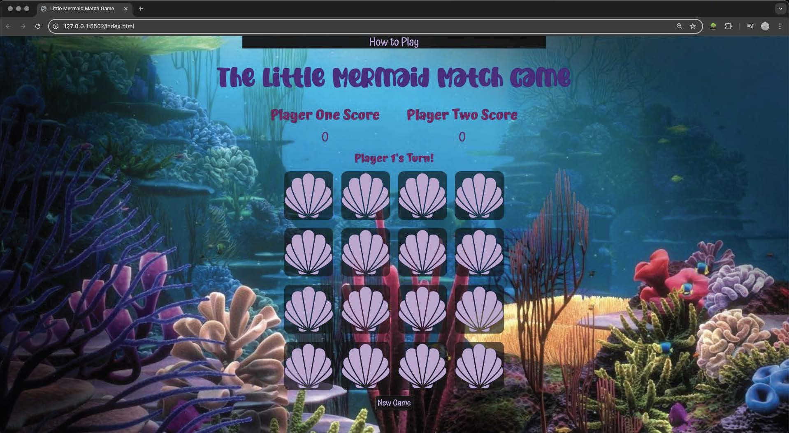
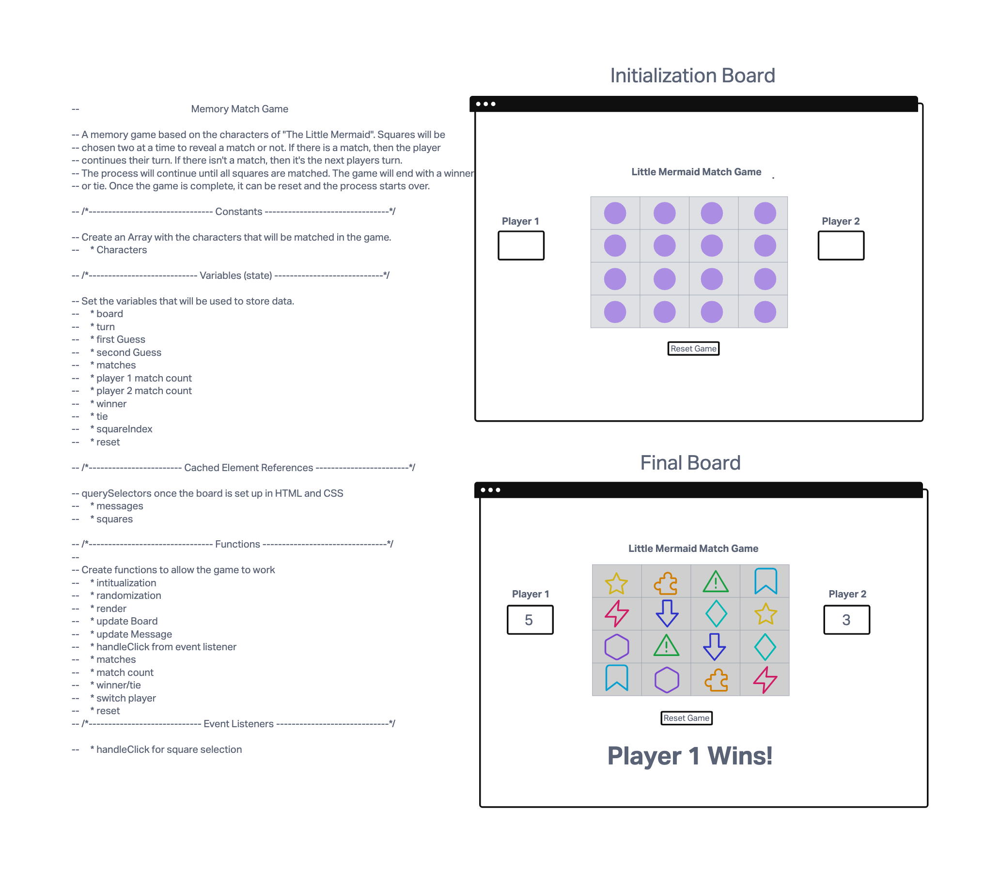

# 🧜🏼‍♀️ The Little Mermaid Match Game 🧜🏼‍♀️
The Little Mermaid Match Game is a basic memory game inspired by my colorful 3.5 year old daughter who adores mermaids and princesses! The goal of the game is to match the 8 different characters and the player with the most matches wins the game.

## Getting Started
Click to Play: [The Little Mermaid Match Game](https://brady-newhard.github.io/little-mermaid-match-game/)

### Wireframe

## Attributions
Little Mermaid Character Images:
[pngegg.com](https://www.pngegg.com)

Seashell Image:
[cricut.com](https://design.cricut.com/)

The background image of a coral reef was generated using ChatGPT

## Technologies
- HTML5
- CSS3
- JavaScript

## Future Enhancement
- Make a trident cursor
- Add a timer and create a point system that awards more points for faster matches.
- Develop a leaderboard
- Improve accessibility to create a more visually impaired-friendly experience.